<div align="center">


# VibeIsland

**MacBook 刘海上的指挥中心。**

媒体、AI 编程助手、系统状态和日常工具随时可见，却不会占据你的桌面。

`macOS 14.6+` · `SwiftUI` · `GPL-3.0`

[English](ReadMe.md) · **简体中文**

</div>

> [!NOTE]
> 本中文文档绝大部分由 AI 翻译。如果发现表述不准确、术语不当或与实际功能不符的地方，
> 欢迎[提 issue](https://github.com/Zaaacqwq/vibeIsland/issues) 指出，非常感谢。
> 以 [English 版本](ReadMe.md)为准。

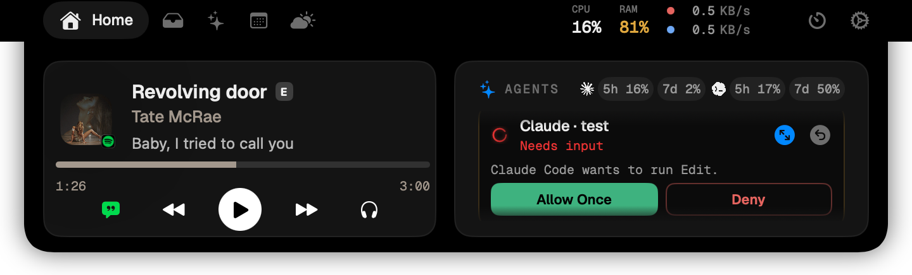

## VibeIsland 能做什么

- **AI 助手指挥中心** —— 跟踪进行中的会话，查看哪些助手在等待输入，回答提问，
  批准或拒绝权限请求，并跳回发起会话的终端。
- **用量一目了然** —— 查看各服务商的速率限制、token 用量、缓存活动、花费和活跃时长。
- **媒体与实时活动** —— 控制播放，并在刘海周围呈现当下重要的状态。
- **效率工具** —— 无需打开其他窗口即可使用日历、计时器、天气、文件架、下载、
  快捷指令和通知。
- **原生系统 HUD** —— 用适配刘海的音量、亮度、电池、输入法和设备指示器替换
  指定的 macOS 浮层。
- **可自定义的行为** —— 在设置中调整布局、动画、悬停行为、自动展开、声音以及
  各个独立模块。

## AI 助手，无需来回切换

VibeIsland 为 **Claude Code**、**Codex**、**Gemini CLI**、**Antigravity**、
**OpenCode** 和 **Cursor** 提供一键式钩子/插件配置。会话运行时可以保持收起状态，
当助手提问或请求权限时，会自动浮现 —— 伴随红色光晕和提示音。

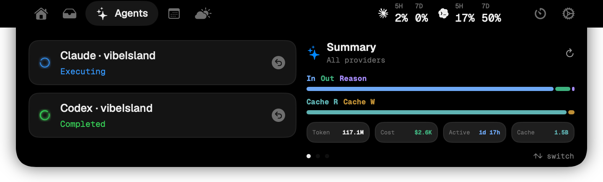

### 直接在刘海里响应

| 提问 | 权限请求 |
| --- | --- |
| 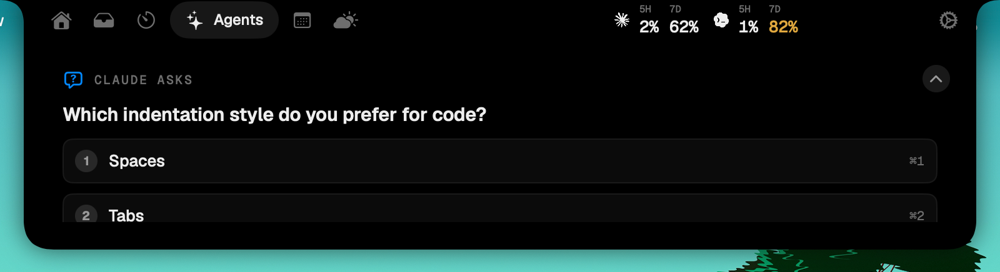 | 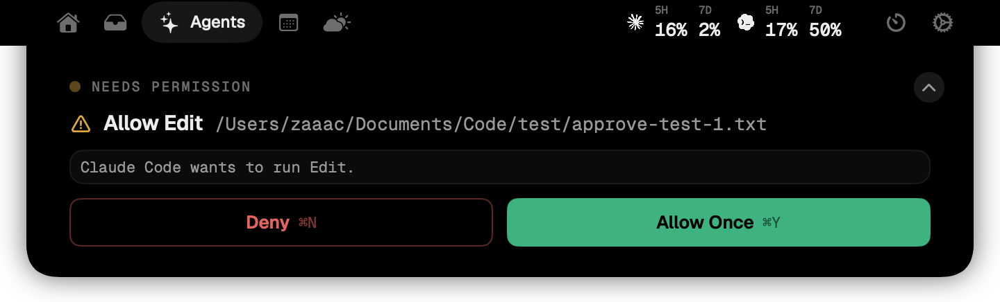 |

### 跟踪服务商用量

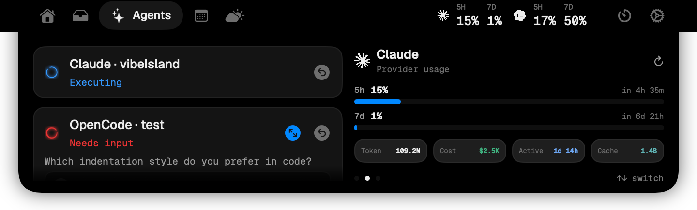

VibeIsland 的用量面板将助手会话监控与服务商用量分开处理，因此那些没有提供实时钩子的
工具，仍然可以作为用量卡片显示出来。

| 服务商 / 工具 | 实时会话 | 状态 | 刘海内操作 | 用量数据 |
| --- | --- | --- | --- | --- |
| Claude Code | 支持 | 空闲 · 思考中 · 执行中 · 压缩中 · 等待输入 · 已完成 | 回答提问、批准/拒绝权限、跳回 | Token、缓存、活跃时长、花费，以及 Claude 5 小时 / 7 天速率限制窗口 |
| Codex | 支持 | 思考中 · 执行中 · 等待输入 · 已完成 | 批准/拒绝权限；提问仅只读展示（需在终端作答）、跳回 | Token、缓存、推理、活跃时长、花费，以及 5 小时 / 每周窗口 |
| OpenCode | 支持 | 思考中 · 执行中 · 等待输入 · 已完成 | 回答提问、批准/拒绝权限、跳回 | Token、缓存、活跃时长、花费，以及配额窗口（需登录） |
| Antigravity | 支持 | 执行中 · 已完成 | 会话状态、跳回 | Token、缓存、活跃时长、花费，以及共享配额窗口（需登录） |
| Gemini CLI | 支持 | 思考中 · 已完成 | 会话状态、跳回 | Token、缓存、推理、活跃时长和花费 |
| Cursor | 支持 | 思考中 · 执行中 · 等待输入 · 已完成 | 等待你操作时显示光晕并提示音；跳回 Cursor 中批准（实际决策由它自己的允许列表决定） | 从 cursor.com 导出的 Token 与花费 |
| GitHub Copilot | 仅用量 | — | — | 在有本地用量数据时提供 Token、缓存、活跃时长和花费 |

可以在刘海内回答的提问和权限请求，使用的是各工具的阻塞式钩子；Codex 的提问和 Cursor
的命令只做呈现（光晕、文本、跳回），但需要在终端作答 —— 因为这些工具没有提供把答案
回传的通道。

跳回功能依赖各钩子捕获的终端元数据；当无法精确定位窗格时，会退而打开对应的应用或工作区。

| 终端 / 宿主 | 跳回行为 |
| --- | --- |
| iTerm、Terminal.app、Ghostty | 激活应用，并在可能时定位到匹配的会话、标签页、TTY 或标题 |
| Warp | 激活 Warp，并利用 Warp 的实时窗格状态尝试精确定位标签页 |
| WezTerm、Kaku | 通过应用 CLI，按窗格 id、标题或工作目录聚焦匹配的窗格 |
| tmux、Zellij、cmux | 定位到记录的窗格或界面，然后激活父终端 |
| VS Code、VS Code Insiders、Cursor、Windsurf、Trae | 在对应的编辑器中重新打开记录的工作区 |
| JetBrains 系列 IDE | 在 IntelliJ IDEA、WebStorm、PyCharm、GoLand、CLion、RubyMine、PhpStorm、Rider 或 RustRover 中打开记录的项目 |
| Codex.app | 在有 thread id 时直接打开记录的 Codex 会话 |

## 不只是助手监控

同一套界面也承载了日常会用到的各种工具。

| 文件架与隔空投送 | 日历 |
| --- | --- |
| 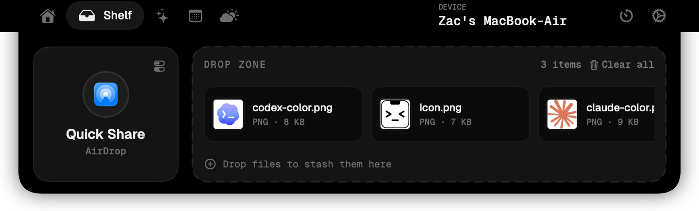 | 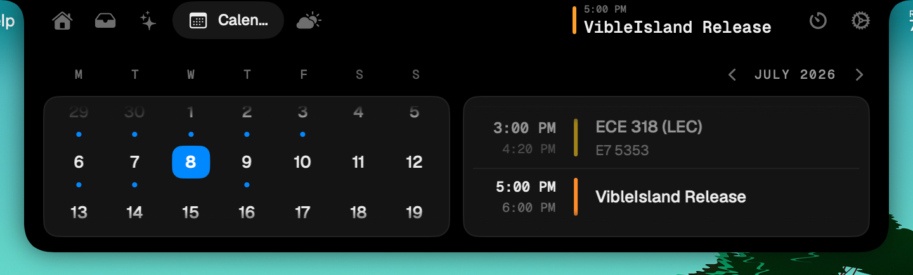 |
| **天气** | **计时器** |
| 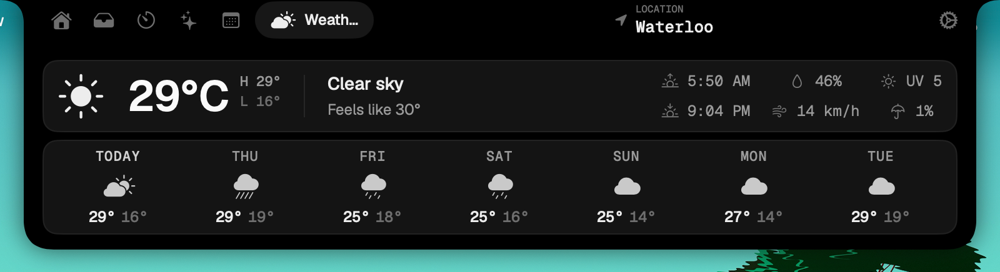 | 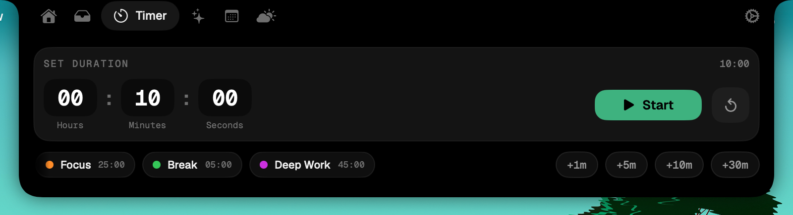 |

## 收起状态下的实时活动

刘海收起时，VibeIsland 只保留值得一瞥的内容 —— 媒体与歌词、天气、正在运行的计时器，
以及当前的专注模式。

| 正在播放 | 实时歌词 |
| --- | --- |
| 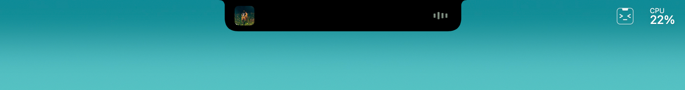 | 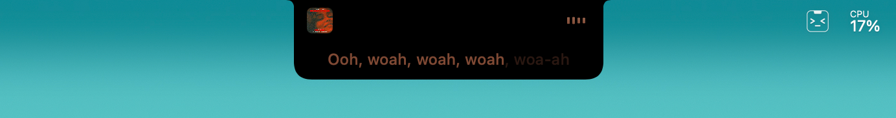 |
| **天气** | **计时器** |
| 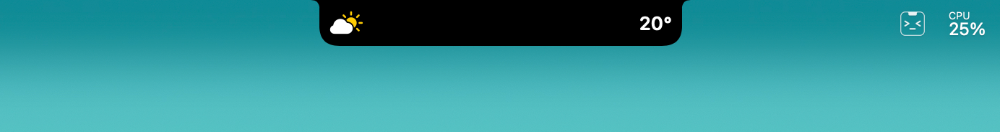 | 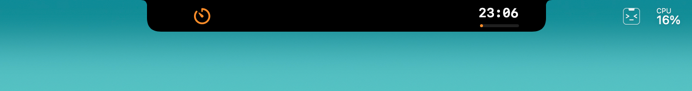 |
| **专注模式** | **编程助手** |
| 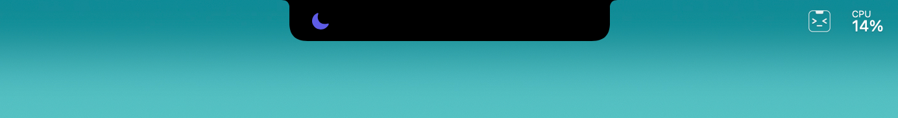 | 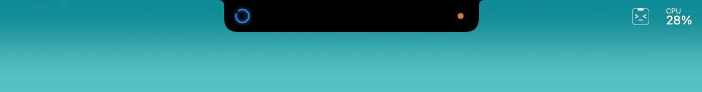 |

## 原生系统 HUD

VibeIsland 可以把指定的 macOS 浮层替换为适配刘海的指示器，涵盖电源、音频设备、
输入法和键盘状态。

| 充电 | 低电量 |
| --- | --- |
| 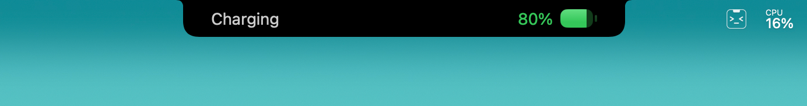 | 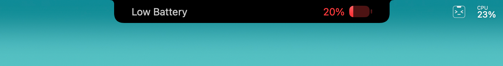 |
| **AirPods 已连接** | **耳机通透模式** |
| 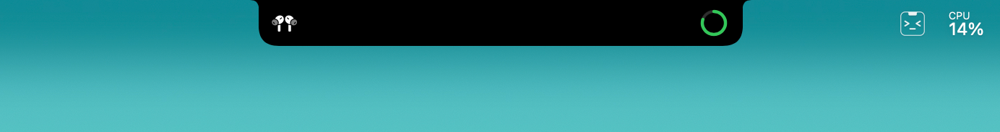 | 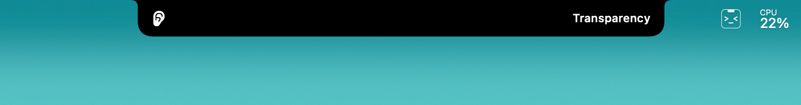 |
| **输入法** | **大写锁定** |
| 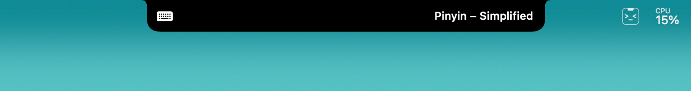 | 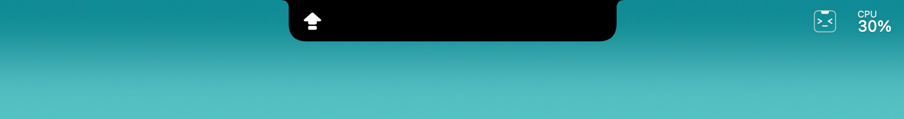 |

## 系统要求

- 运行 macOS 14.6 或更高版本的 Mac
- 从源码构建需要 Xcode 16 或更高版本

## 安装

从 [Releases](https://github.com/Zaaacqwq/vibeIsland/releases) 下载最新的
`VibeIsland-x.y.z.dmg`，打开后把 **VibeIsland** 拖入**应用程序**。

本应用未经过公证（没有付费的 Apple Developer 证书），因此首次启动需要额外一步：

1. 先双击一次应用 —— macOS 会提示无法验证开发者。
2. 打开**系统设置 → 隐私与安全性**，向下滚动，点击**仍要打开**。

或者直接在终端中跳过该提示：

```bash
xattr -cr /Applications/VibeIsland.app
```

## 从源码构建

不需要 Apple Developer 账号，也不需要配置签名 —— 项目默认使用临时（ad-hoc）签名，
开箱即可构建：

```bash
git clone https://github.com/Zaaacqwq/vibeIsland.git
cd vibeIsland
open DynamicIsland.xcodeproj
```

在 Xcode 中选择 **DynamicIsland** scheme 并运行。也可以用命令行构建：

```bash
xcodebuild -project DynamicIsland.xcodeproj \
  -scheme DynamicIsland \
  -configuration Debug \
  -destination 'platform=macOS' \
  build
```

临时签名每次构建都会生成新的身份，这会让 macOS 在重新构建后忘记已授予的 TCC 权限
（辅助功能、日历、通知数据库等）。如果你需要频繁重建，可以把
`Configs/Local.xcconfig.example` 复制为 `Configs/Local.xcconfig` 并填入自己的
team ID —— 免费 Apple ID 即可 —— 以获得稳定的签名身份。

助手监控引擎是位于 `Packages/OpenIslandEngine` 的本地 Swift 包。运行其测试：

```bash
cd Packages/OpenIslandEngine
swift test
```

## 启用助手监控

1. 打开**设置 → 开发者 → Agents**。
2. 开启**启用助手监控**。
3. 为你使用的每个编程助手安装对应集成。
4. 启动一个新的助手会话，它会自动出现在刘海中。

安装程序会向各工具的本地配置中添加带 VibeIsland 命名空间的钩子或插件。这些集成采用
失败即放行的策略：如果 VibeIsland 没有运行，它们不会阻塞编程助手。

## 致谢与许可证

VibeIsland 是一个独立项目，基于开源刘海应用
[Atoll](https://github.com/Ebullioscopic/Atoll) 构建。

本项目采用 **GNU General Public License v3.0** 许可证。许可证详见
[LICENSE](LICENSE)，完整署名信息详见 [NOTICE](NOTICE)。
